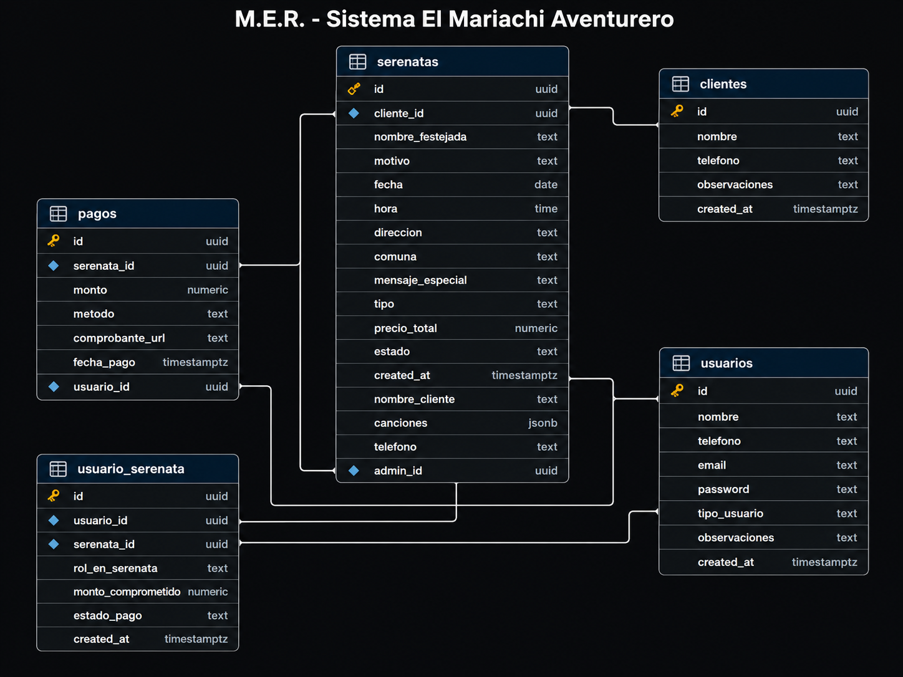

<p align="center">
  
</p>

<h1 align="center">Sistema de Gestión de Serenatas</h1>

<p align="center">
  <strong>Plataforma integral multiplataforma para la administración profesional de servicios de serenatas a domicilio.</strong>
</p>

<p align="center">
  
  
  
  
  
  
</p>

<p align="center">
  <a href="https://web-prubilarms-projects.vercel.app">🌐 Demo en Producción</a> •
  <a href="https://api-alpha-five-25.vercel.app/api-docs">📖 Documentación API (Swagger)</a>
</p>

---

## 📋 Tabla de Contenidos

- [Descripción](#-descripción)
- [Arquitectura](#-arquitectura)
- [Tech Stack](#-tech-stack)
- [Modelo de Datos (MER)](#-modelo-de-datos-mer)
- [Funcionalidades](#-funcionalidades)
- [Estructura del Proyecto](#-estructura-del-proyecto)
- [Instalación y Configuración](#-instalación-y-configuración)
- [Variables de Entorno](#-variables-de-entorno)
- [Scripts Disponibles](#-scripts-disponibles)
- [API Endpoints](#-api-endpoints)
- [Despliegue en Producción](#-despliegue-en-producción)
- [Licencia](#-licencia)

---

## 🎶 Descripción

**El Mariachi Aventurero** es un sistema completo de gestión empresarial diseñado para un emprendimiento de serenatas a domicilio en Los Ángeles, Chile. Permite administrar todo el ciclo de vida de una serenata: desde la reserva inicial hasta el cobro final, con soporte para múltiples clientes por evento, selección de repertorio musical y generación automática de documentos PDF profesionales.

### ¿Qué problema resuelve?

| Antes ❌ | Ahora ✅ |
|----------|----------|
| Reservas anotadas en cuadernos y WhatsApp | Base de datos centralizada con acceso multiplataforma |
| Sin control de pagos ni abonos parciales | Trazabilidad financiera completa por participante |
| Un solo cliente por evento | Modelo multi-cliente con roles y montos individuales |
| Sin documentos formales | PDF de reserva y comprobante de pago autogenerados |
| Conflictos de agenda frecuentes | Calendario visual con vista diaria y semanal |

---

## 🏗 Arquitectura

```
┌─────────────────────────────────────────────────────────────────┐
│                        PRODUCCIÓN (Vercel)                      │
├─────────────────────┬───────────────────────────────────────────┤
│                     │                                           │
│   ┌─────────────┐   │   ┌─────────────────────────────────┐    │
│   │  Frontend    │   │   │         Backend API              │    │
│   │  Next.js 15  │◄──┼──►│  Express.js + TypeScript        │    │
│   │  (React)     │   │   │  Swagger Docs + PDFKit          │    │
│   └─────────────┘   │   └──────────────┬──────────────────┘    │
│                     │                  │                        │
├─────────────────────┤                  │                        │
│                     │                  ▼                        │
│   ┌─────────────┐   │   ┌─────────────────────────────────┐    │
│   │  Mobile App  │   │   │       Supabase (PostgreSQL)     │    │
│   │  React Native│───┼──►│  Auth + Database + Realtime     │    │
│   │  Expo        │   │   │  Row Level Security (RLS)       │    │
│   └─────────────┘   │   └─────────────────────────────────┘    │
│                     │                                           │
└─────────────────────┴───────────────────────────────────────────┘
```

---

## 🛠 Tech Stack

### Frontend Web
| Tecnología | Uso |
|------------|-----|
| **Next.js 15** | Framework React con SSR/SSG |
| **React 19** | Librería UI con componentes funcionales |
| **Lucide React** | Sistema de iconos |
| **date-fns** | Formateo de fechas en español |
| **CSS Modules** | Estilos con diseño premium dark-mode + gold (#D4AF37) |

### Backend API
| Tecnología | Uso |
|------------|-----|
| **Express.js 4** | Servidor HTTP y routing RESTful |
| **TypeScript** | Tipado estático y seguridad en tiempo de desarrollo |
| **Swagger (OpenAPI)** | Documentación automática de la API |
| **PDFKit** | Generación de documentos PDF premium |
| **Zod** | Validación de esquemas de datos |

### Mobile
| Tecnología | Uso |
|------------|-----|
| **React Native** | Framework UI móvil multiplataforma |
| **Expo SDK** | Toolchain de desarrollo y build |
| **expo-local-authentication** | Login biométrico (huella digital) |
| **expo-secure-store** | Almacenamiento seguro de credenciales |
| **expo-print + expo-sharing** | Generación y envío de PDFs |

### Base de Datos & Infraestructura
| Tecnología | Uso |
|------------|-----|
| **Supabase** | BaaS con PostgreSQL, Auth y Realtime |
| **PostgreSQL** | Motor relacional con RLS |
| **Vercel** | Hosting serverless (frontend + API) |

---

## 📊 Modelo de Datos (MER)

<p align="center">
  
</p>

### Tablas Principales

| Tabla | Descripción | Registros Clave |
|-------|-------------|-----------------|
| `usuarios` | Administradores y clientes del sistema | `tipo_usuario`: `'admin'` \| `'cliente'` |
| `serenatas` | Eventos de serenata con toda la info logística | Estados: `pendiente` → `confirmada` → `completada` |
| `usuario_serenata` | Relación N:M entre usuarios y serenatas | Roles: `comprador`, `contacto`, `acompañante` |
| `pagos` | Transacciones de pago por participante | Métodos: `efectivo`, `transferencia` |
| `clientes` | *(Legacy)* Tabla original, reemplazada por `usuarios` | Mantenida por compatibilidad |

### Relaciones

```
usuarios ──┬── 1:N ──► usuario_serenata ◄── 1:N ──┬── serenatas
            │                                       │
            └── 1:N ──► pagos ◄──────── 1:N ────────┘
```

---

## ✨ Funcionalidades

### 📱 App Móvil (React Native + Expo)
- ✅ Login con email/contraseña + **autenticación biométrica** (huella digital)
- ✅ Agenda de serenatas con búsqueda y filtros (hoy / pendientes / todas)
- ✅ Creación y edición de serenatas con formulario completo
- ✅ Asociación **multi-cliente** con roles y montos individuales
- ✅ Selector de **repertorio musical** (33 canciones + personalizadas)
- ✅ **Predicción inteligente** de comunas basada en dirección
- ✅ Registro de pagos por participante con cálculo automático de estado
- ✅ Generación de **PDF de reserva** y **comprobante de pago** compartibles
- ✅ Suscripción **Realtime** para cambios instantáneos
- ✅ Soporte **offline** con cola de sincronización
- ✅ Vista de serenatas finalizadas

### 🌐 Panel Web (Next.js)
- ✅ **Dashboard** con estadísticas: serenatas del día, ingresos, pendientes, clientes
- ✅ Gestión visual de serenatas con tarjetas interactivas premium
- ✅ Formulario de reserva con selector de canciones y comunas
- ✅ Módulo de **finalización con registro de cobro** (monto + método)
- ✅ **Descarga de PDFs** directamente desde el navegador
- ✅ Vista **Finalizadas** con opción de reabrir eventos
- ✅ Módulo de **Caja** (control de pagos)
- ✅ Módulo de **Clientes**
- ✅ Integración con **WhatsApp** para contactar clientes
- ✅ Diseño premium **dark-mode** con paleta dorada

### ⚙️ API Backend (Express.js)
- ✅ Endpoints RESTful: `GET`, `POST`, `PUT`, `PATCH`, `DELETE`
- ✅ Documentación interactiva con **Swagger UI**
- ✅ Generación de 3 tipos de **PDF** (reporte general, reserva, comprobante)
- ✅ Búsqueda/creación automática de clientes al registrar serenatas
- ✅ Health check endpoint: `/api/health`
- ✅ CORS configurado para acceso multiplataforma
- ✅ Compatible con **Vercel Serverless Functions**

---

## 📁 Estructura del Proyecto

```
serenatas-app/
├── apps/
│   ├── api/                          # Backend Express.js
│   │   ├── src/
│   │   │   ├── controllers/          # Lógica de negocio
│   │   │   │   ├── clienteController.ts
│   │   │   │   ├── serenataController.ts
│   │   │   │   ├── pagoController.ts
│   │   │   │   └── reporteController.ts    # Generación de PDFs
│   │   │   ├── routes/               # Definición de rutas + Swagger docs
│   │   │   │   ├── clienteRoutes.ts
│   │   │   │   ├── serenataRoutes.ts
│   │   │   │   ├── pagoRoutes.ts
│   │   │   │   └── reporteRoutes.ts
│   │   │   ├── utils/
│   │   │   │   ├── supabase.ts       # Cliente Supabase
│   │   │   │   └── swagger.ts        # Configuración OpenAPI
│   │   │   ├── shared-types.ts       # Tipos TypeScript compartidos
│   │   │   └── index.ts             # Entry point del servidor
│   │   ├── vercel.json              # Config Vercel serverless
│   │   └── package.json
│   │
│   ├── web/                          # Frontend Next.js
│   │   └── src/
│   │       ├── app/
│   │       │   ├── page.tsx          # Dashboard principal
│   │       │   ├── login/            # Página de login
│   │       │   ├── serenatas/        # Gestión de serenatas
│   │       │   ├── agenda/           # Vista de agenda/calendario
│   │       │   ├── pagos/            # Control de caja
│   │       │   ├── clientes/         # Gestión de clientes
│   │       │   ├── reportes/         # Reportes y PDFs
│   │       │   ├── globals.css       # Design system completo
│   │       │   └── layout.tsx        # Layout con sidebar
│   │       ├── components/
│   │       │   └── Sidebar.tsx       # Navegación lateral
│   │       ├── lib/                  # Utilidades (supabase, comunas)
│   │       └── middleware.ts         # Auth middleware
│   │
│   └── mobile/                       # App React Native
│       └── src/
│           ├── screens/
│           │   ├── LoginScreen.tsx    # Login + biometría
│           │   ├── AgendaScreen.tsx   # Pantalla principal
│           │   ├── CalendarioScreen.tsx
│           │   ├── ClientesScreen.tsx
│           │   ├── FinalizadasScreen.tsx
│           │   └── SplashScreen.tsx
│           ├── components/
│           │   └── SerenataCard.tsx   # Tarjeta de serenata
│           └── lib/
│               ├── supabase.ts       # Cliente Supabase
│               ├── syncService.ts    # Sincronización offline
│               ├── offlineService.ts # Cola de operaciones offline
│               └── comunas.ts        # Lista de comunas + predicción
│
├── supabase/
│   └── schema.sql                    # Esquema inicial de la BD
│
├── packages/                         # Paquetes compartidos (monorepo)
├── package.json                      # Workspace root (npm workspaces)
└── DIAGRAMA_MER.png                  # Diagrama Entidad-Relación
```

---

## 🚀 Instalación y Configuración

### Prerrequisitos

- **Node.js** ≥ 18.x
- **npm** ≥ 9.x
- Cuenta en [Supabase](https://supabase.com) (tier gratuito funciona)
- (Opcional) [Expo CLI](https://docs.expo.dev/) para la app móvil

### 1. Clonar el repositorio

```bash
git clone https://github.com/tu-usuario/serenatas-app.git
cd serenatas-app
```

### 2. Instalar dependencias

```bash
# Instala todas las dependencias del monorepo
npm install
```

### 3. Configurar la base de datos

1. Crear un proyecto en [Supabase](https://supabase.com)
2. Ejecutar el script `supabase/schema.sql` en el SQL Editor de Supabase
3. Crear las tablas adicionales (`usuarios`, `usuario_serenata`) desde el SQL Editor
4. Habilitar **Row Level Security** en todas las tablas

### 4. Configurar variables de entorno

```bash
# Copiar el ejemplo
cp .env.example .env

# Editar con tus credenciales de Supabase
```

### 5. Ejecutar en desarrollo

```bash
# Terminal 1 — Backend API
npm run dev:api

# Terminal 2 — Frontend Web
npm run dev:web

# Terminal 3 — App Móvil (requiere Expo)
npm run dev:mobile
```

---

## 🔐 Variables de Entorno

### API (`apps/api/.env`)

```env
SUPABASE_URL=https://tu-proyecto.supabase.co
SUPABASE_SERVICE_ROLE_KEY=tu_service_role_key
SUPABASE_ANON_KEY=tu_anon_key
PORT=3001
```

### Web (`apps/web/.env.local`)

```env
NEXT_PUBLIC_SUPABASE_URL=https://tu-proyecto.supabase.co
NEXT_PUBLIC_SUPABASE_ANON_KEY=tu_anon_key
NEXT_PUBLIC_API_URL=http://localhost:3001/api
```

### Mobile (`apps/mobile/.env`)

```env
EXPO_PUBLIC_SUPABASE_URL=https://tu-proyecto.supabase.co
EXPO_PUBLIC_SUPABASE_ANON_KEY=tu_anon_key
```

---

## 📜 Scripts Disponibles

| Script | Descripción |
|--------|-------------|
| `npm run dev:api` | Inicia el backend en modo desarrollo (puerto 3001) |
| `npm run dev:web` | Inicia el frontend Next.js (puerto 3000) |
| `npm run dev:mobile` | Inicia Expo para la app móvil |
| `npm run build` | Compila el frontend web para producción |

---

## 🔌 API Endpoints

### Serenatas
| Método | Endpoint | Descripción |
|--------|----------|-------------|
| `GET` | `/api/serenatas` | Listar todas las serenatas (con participantes) |
| `POST` | `/api/serenatas` | Crear nueva serenata |
| `PUT` | `/api/serenatas/:id` | Actualizar una serenata |
| `PATCH` | `/api/serenatas/:id/estado` | Cambiar solo el estado |
| `DELETE` | `/api/serenatas/:id` | Eliminar una serenata |

### Clientes
| Método | Endpoint | Descripción |
|--------|----------|-------------|
| `GET` | `/api/clientes` | Listar todos los clientes |
| `POST` | `/api/clientes` | Registrar nuevo cliente |

### Pagos
| Método | Endpoint | Descripción |
|--------|----------|-------------|
| `GET` | `/api/pagos` | Listar todos los pagos |
| `GET` | `/api/pagos/serenata/:id` | Pagos de una serenata específica |
| `POST` | `/api/pagos` | Registrar un nuevo pago |

### Reportes (PDF)
| Método | Endpoint | Descripción |
|--------|----------|-------------|
| `GET` | `/api/reportes/pdf` | Reporte general de actividades |
| `GET` | `/api/reportes/serenata/:id` | PDF de confirmación de reserva |
| `GET` | `/api/reportes/pago/:id` | PDF de comprobante de pago |

### Utilidad
| Método | Endpoint | Descripción |
|--------|----------|-------------|
| `GET` | `/api/health` | Health check del servidor |
| `GET` | `/api-docs` | Documentación Swagger UI |

---

## 🌍 Despliegue en Producción

El sistema está desplegado en **Vercel** con la siguiente configuración:

| Servicio | URL | Plataforma |
|----------|-----|------------|
| Frontend Web | [web-prubilarms-projects.vercel.app](https://web-prubilarms-projects.vercel.app) | Vercel (Next.js) |
| API Backend | [api-alpha-five-25.vercel.app](https://api-alpha-five-25.vercel.app) | Vercel (Serverless) |
| Base de Datos | Supabase Cloud | PostgreSQL managed |

### Deploy manual

```bash
# Frontend
cd apps/web
npx vercel --prod

# Backend
cd apps/api
npx vercel --prod
```

---

## 🎨 Design System

El sistema utiliza una paleta premium **dark-mode** inspirada en la elegancia del mariachi:

| Token | Color | Uso |
|-------|-------|-----|
| `--bg-primary` | `#0A0A0A` | Fondo principal |
| `--bg-secondary` | `#111111` | Fondos de tarjetas |
| `--accent-gold` | `#D4AF37` | Color principal dorado |
| `--text-primary` | `#FFFFFF` | Texto principal |
| `--text-secondary` | `rgba(255,255,255,0.4)` | Texto secundario |
| `--success` | `#2ecc71` | Estados positivos |
| `--warning` | `#f1c40f` | Estados pendientes |
| `--danger` | `#e74c3c` | Acciones destructivas |

---

## 👤 Autor

**El Mariachi Aventurero** — Los Ángeles, Biobío, Chile 🇨🇱

> *"Hacemos de cada momento algo inolvidable"* 🎺

---

## 📄 Licencia

Este proyecto es de uso privado y está protegido por derechos de autor. Todos los derechos reservados © 2026.
